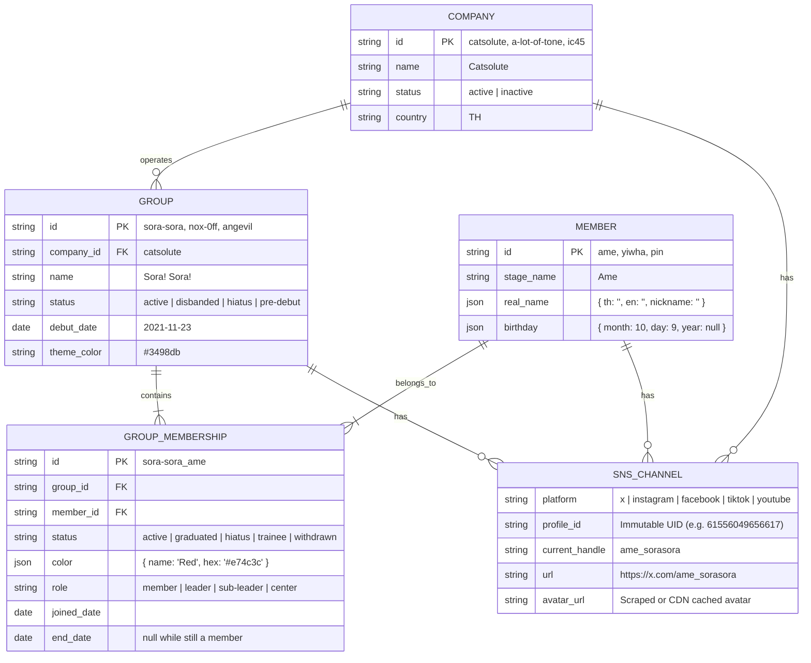
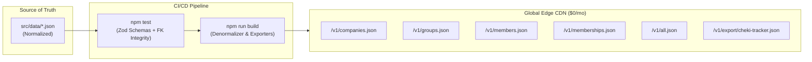

# ThaiDoru Core — Complete System Requirements & Architecture Specification

> [!NOTE]
> This document serves as the authoritative specification, memory bank, and living architectural blueprint for **ThaiDoru Core (`thaidoru-core`)**. It records the vision, domain constraints, schema definitions, infrastructure decisions, integration contracts, and evolutionary roadmap.

---

## 1. Project Vision & Core Objectives

### 1.1 The Problem
Thai underground idol data has historically been fragmented across social media posts, fan spreadsheets, and disparate apps. Previous attempts to store idol metadata in flat JSON files (e.g. legacy `idols.json`) suffered from fatal design flaws:
1. **Flat / Denormalized Duplication**: Mixing `type: "member"` and `type: "group"` in the same array.
2. **Inability to Handle Transitions**: Idols moving from one group to another or joining sub-units broke historical records.
3. **Color Ambiguity**: Assigning color directly to a member rather than to their group membership caused data corruption (e.g. *Yiwha* in *Sora! Sora!* was **Black**, but in *Nox:0ff* is **White**; *Chihiro* in *Eclipse* was **White**, but in *Genpa SYNC* is **Blue**).
4. **Broken Social Links**: Idol social handles regularly change on rebranding, breaking static scraping links.
5. **Expiring Image URLs**: Social media CDN links (especially Meta/Instagram) use cryptographically signed tokens (`?oe=...`) that expire within 24–72 hours, resulting in dead avatar images across client apps.

### 1.2 The Mission
To build a **canonical, up-to-date, single source of truth** for Thai underground idols, starting with **Catsolute**, **A lot of Tone**, and **IC45**, expanding to the entire ecosystem.

Downstream consumers include:
* **Cheki Tracker v2 (Immediate Use Case)**: Real-time metadata subscription for Back Office idol tracking.
* **Follower Scraper**: Time-series social growth metrics (daily/weekly).
* **Schedule & Event Tracker**: Live gigs, cafe events, cheki sessions, and member birthdays.
* **Wiki & Community Directory**: Comprehensive member profiles, discography, and graduation history.

---

## 2. Domain Data Architecture & Entity Modeling

To eliminate redundancy and support accurate historical auditing, the domain is split into **5 core normalized entities**:



### 2.1 Entity Rules & Constraints

#### A. `Company` (`src/schemas/company.ts`)
* `id`: Unique slug (e.g. `catsolute`, `a-lot-of-tone`, `ic45`, `individual`).
* `name`: Display name.
* `status`: `active` or `inactive`.
* `country`: Country identifier (default: `Thailand`).
* `sns`: Array of company-level official SNS accounts.

#### B. `Group` (`src/schemas/group.ts`)
* `id`: Unique slug (e.g. `sora-sora`, `yami-yami`, `mirai-mirai`, `dream-0n`, `nox-0ff`, `angevil`, `castella`, `tgg`).
* `company_id`: Foreign key referencing `Company.id` (strictly enforced via referential integrity tests).
* `name`: Display name (e.g. "Sora! Sora!").
* `status`: `active`, `disbanded`, `hiatus`, or `pre-debut`.
* `country`: Country identifier (default: `Thailand`).
* `debut_date` / `disband_date`: `YYYY-MM-DD` (nullable).
* `theme_color`: Group brand color (`{ name: string, hex: string }`).
* `music_links`: Record of streaming URLs (e.g. `spotify`, `apple_music`).

#### C. `Member` (`src/schemas/member.ts`)
Represents the human idol entity independent of group affiliations:
* `id`: Canonical slug (e.g. `ame`, `yiwha`, `nadear`, `pim`).
* `stage_name`: Primary stage name.
* `stage_name_th`: Thai stage name (nullable).
* `real_name`: Structured object (`first_name_th`, `last_name_th`, `first_name_en`, `last_name_en`, `nickname`).
* `birthday`: Structured object (`month`: 1–12, `day`: 1–31, `year`: nullable).
  * *Reasoning*: Most idols publicly share Month and Day but hide birth year. This structure enables birthday notifications and sorting without breaking standard date parsers.
* `sns`: Array of personal/idol SNS channels.

#### D. `GroupMembership` (`src/schemas/membership.ts`)
**The critical junction entity** binding a Member to a Group:
* `id`: Composite key `{group_id}_{member_id}` (e.g. `sora-sora_yiwha`, `nox-0ff_yiwha`).
* `group_id`: Foreign key referencing `Group.id`.
* `member_id`: Foreign key referencing `Member.id`.
* `status`: `active`, `graduated`, `hiatus`, `trainee`, or `withdrawn`.
* `role`: `member`, `leader`, `sub-leader`, `center`, `trainee`, or `guest`.
* `color`: Contextual image color `{ name: string, hex: string }` (6-character hex code).
* `joined_date`: `YYYY-MM-DD` (nullable).
* `end_date`: `YYYY-MM-DD`, the last day in the group (nullable; null while still a member). There is no separate active flag — a membership is active when `status === 'active'`. `is_active` and `graduated_date` used to duplicate these and were removed (2026-09-25); the Cheki Tracker export still emits `is_active`/`end_date`, derived from them.
* *Note on `graduated_reason`*: Intentionally omitted as unnecessary metadata (refined 2026-09-14).

---

## 3. Social Media Identity Tracking & Asset Management

### 3.1 Resolving Handle Volatility (`profile_id`)
Idols and groups regularly rebrand or change social handles upon agency transfers, graduations, or name updates. To maintain historical continuity, every SNS channel record preserves an **immutable platform UID** alongside the mutable handle:

| Platform | Mutable Identifier | Immutable Unique Key (`profile_id`) | Extraction Method (Page Source) |
|---|---|---|---|
| **X (Twitter)** | Screen Name (`@ame_sorasora`) | Numeric `rest_id` (e.g. `1465241088492810240`) | In HTML `__INITIAL_STATE__`, JSON-LD, or `api.x.com` syndication |
| **Facebook** | Vanity handle (`Best.sorasora`) | Page/User numeric ID (e.g. `61556049656617`) | In HTML: `fb://page/<id>`, `"pageID":"..."`, or `profile.php?id=<id>` |
| **Instagram** | Username (`ame.sorasora`) | Numeric `user_id` / `pk` (e.g. `18577382176063960`) | In HTML: `"profile_id":"..."` or `window.__additionalData` |
| **TikTok** | Handle (`@ameaun`) | `secUid` / `authorId` | In HTML `<script id="__UNIVERSAL_DATA_FOR_REHYDRATION__">` |

### 3.2 Permanent Avatar Asset Preservation
> [!WARNING]
> **The Meta CDN Expiration Trap**:
> Instagram and Facebook CDN URLs (`scontent.cdninstagram.com`, `fbcdn.net`) contain signed expiration tokens (`?oe=...&oh=...`) that return HTTP 403 Forbidden after 24–72 hours. Hotlinking source URLs directly will permanently break downstream client apps.

* **Phase 1 Strategy**: Reference stable X (Twitter) profile images or local asset paths.
* **Phase 2 Pipeline**: Automated avatar scraper downloads the latest avatar thumbnail, converts it to lightweight WebP ($400\times400\text{px}$, ~25 KB), and caches it to Cloudflare R2 / Git assets (`cdn.thaidoru.org/avatars/members/{id}.webp`).

---

## 4. Technology Stack & Distribution Architecture



### 4.1 "Git-as-Database" + Edge CDN Model
Because the entire Thai underground idol ecosystem consists of ~100 groups and ~1,000 members (under **500 KB** total payload), hosting a dynamic relational database cluster (e.g. Postgres / RDS) for client reads creates unnecessary cost, connection pool limits, and downtime risk.

**The Solution**:
* **Source of Truth**: Normalized JSON files in Git (`src/data/`).
* **Validation**: Automated TypeScript/Zod tests on every commit (`npm test`).
* **Build Step**: High-speed Node.js compiler (`src/scripts/build.ts`) produces pre-compiled, denormalized JSON endpoints under `dist/v1/`.
* **Hosting**: Distributed via **GitHub Pages / Cloudflare Pages**:
  * **Cost**: $0.00 / month forever.
  * **Latency**: <15ms globally (Edge CDN cache).
  * **Reliability**: 100% serverless uptime, zero cold starts.
  * **Auditability**: Complete Git commit history and author blame for every data change.

### 4.2 Compiled Distribution Endpoints

| Endpoint | Content | Target Consumers |
|---|---|---|
| `GET /v1/companies.json` | Normalized company directory | General directories, agency views |
| `GET /v1/groups.json` | Normalized group profiles + theme colors + music links | Group listing, event schedules |
| `GET /v1/members.json` | Canonical idol profiles + birthdays + real names | Idol wikis, birthday trackers |
| `GET /v1/memberships.json` | Group-member junction records with colors & statuses | Relational joins, roster history |
| `GET /v1/all.json` | Fully denormalized single bundle (Company $\rightarrow$ Groups $\rightarrow$ Members) | Single-fetch mobile/web apps |
| `GET /v1/export/cheki-tracker.json` | Drop-in format matching `dim_member`, `dim_group`, `dim_company` | **Cheki Tracker v2 Back Office** |

---

## 5. Cheki Tracker v2 Integration Specification

The endpoint `/v1/export/cheki-tracker.json` directly implements the schema contract expected by `cheki-tracker-v2/lib/seedData.ts` and `cheki-tracker-v2/app/backoffice/page.tsx`:

```json
{
  "version": "1.0.0",
  "updated_at": "2026-09-14T17:29:43.344Z",
  "dim_company": [
    { "company": "Catsolute" },
    { "company": "A lot of Tone" },
    { "company": "IC45" }
  ],
  "dim_group": [
    {
      "group": "Sora! Sora!",
      "company": "Catsolute",
      "country": "🇹🇭 TH",
      "is_active": true
    }
  ],
  "dim_member": [
    {
      "member_name": "Yiwha",
      "member_image": "https://pbs.twimg.com/profile_images/2064332598273548289/igts58sl_400x400.jpg",
      "color": "White",
      "group": "Nox:0ff",
      "country": "🇹🇭 TH",
      "company": "Catsolute",
      "start_date": "1001-01-01",
      "end_date": "9999-12-31",
      "is_active": true,
      "x_profile": "https://x.com/yiwha_nox0ff",
      "_metadata": {
        "canonical_member_id": "yiwha",
        "canonical_group_id": "nox-0ff",
        "canonical_membership_id": "nox-0ff_yiwha",
        "color_hex": "#ffffff",
        "role": "member",
        "status": "active"
      }
    }
  ]
}
```

---

## 6. Project Phased Roadmap

### Phase 1: Canonical Foundation & Manual Curation (Status: Completed)
- [x] Create standalone repository `/Users/pavin/01 Pavin Coding/thaidoru-core`.
- [x] Author TypeScript & Zod schemas (`company`, `group`, `member`, `membership`, `sns`).
- [x] Migrate and normalize Catsolute (5 groups, 40 members), A lot of Tone (Angevil, Castella), and IC45 (TGG).
- [x] Build compilation engine (`src/scripts/build.ts`) outputting `dist/v1/*.json`.
- [x] Implement automated validation test suite (`src/scripts/test.ts`) covering schema validation and referential integrity.
- [x] Implement Cheki Tracker adapter (`/v1/export/cheki-tracker.json`).
- [x] Configure GitHub Actions CI/CD workflow (`.github/workflows/deploy.yml`).
- [x] Refine membership fields (removed `graduated_reason`).

### Phase 2: Follower Scraper & Asset Pipeline (In Progress)
- [x] Implement `profile_id` extraction script to populate immutable UIDs (`src/scripts/resolve-profile-ids.ts`).
- [x] Populate full rosters for A lot of Tone (ANGeVIL✟, Castella) and IC45 (The Glass Girls) — expanded database to 68 members and 69 memberships.
- [x] Expand group catalog to **17 groups** across Catsolute (5), A lot of Tone (8), and IC45 (4), including HatoBito, KŌMA, LUMIN+US, Seishin Kakumei, Chocolatière, VIINX, Nikko Nikko, STARRY☆NITE, and ZYN.
- [x] Connect avatar caching pipeline (`src/scripts/cache-avatars.ts` using `sharp`), achieving **100% avatar cache coverage** across all 68 members, all 17 groups, and all 3 agencies/companies (~1.9 MB total in `assets/avatars/`).
- [x] Serve permanent avatars via GitHub Pages Edge CDN (`https://pavinss2.github.io/thaidoru-core/assets/avatars/{id}.webp`).
- [x] Build interactive connected visual directory frontend (`dist/index.html`) on GitHub Pages with instant fuzzy search, multi-facet filtering (agency, group, status), cross-link navigation, and responsive detail modals.
- [x] Enrich 100% of idols with verified birthdays (`month`, `day`, and `year` where known) and real Thai/English names.
- [x] Achieve 100% social media link completeness across all 17 groups (Facebook, X, Instagram) and all 3 companies.
- [ ] Create time-series follower scraping workflow logging daily/weekly counts (Paused per user instruction).

### Phase 3: AI-Powered Weekly Ingestion Pipeline (Planned)
- [ ] Build weekly feed crawler for official agency Facebook & X pages.
- [ ] Integrate **Gemini 2.0 Flash** structured extraction engine to detect:
  * New member debuts
  * Graduations & transfers
  * Member color announcements
  * Weekly event schedules
- [ ] Automated GitHub Pull Request generator for safe 1-click human verification.

---

## 7. Memory Bank & Architecture Decision Records (ADRs)

| Date | Decision | Rationale | Impact |
|---|---|---|---|
| **2026-09-14** | Dedicated standalone repo `thaidoru-core` | Keep canonical data cleanly decoupled from Cheki Tracker and legacy stats scrapers. | Independent release cycle, reusable by multiple apps. |
| **2026-09-14** | Normalized junction entity `GroupMembership` | Member color and active status are attributes of the (Member, Group) combination, not the Member alone. | Accurately models idol transfers, sub-units, and concurrent memberships. |
| **2026-09-14** | Structured `birthday` object (`month`, `day`, `year`, `raw_text`) | Underground idols rarely publicize birth years. | Eliminates date parsing errors while supporting birthday reminders. |
| **2026-09-14** | Immutable `profile_id` on SNS channels | Usernames/handles mutate on rebrand or transfer. | Guarantees long-term crawler stability across handle changes. |
| **2026-09-14** | Git-as-Database + Edge CDN API ($0/mo) | Total dataset < 500 KB; dynamic DB is costly and prone to connection exhaustion. | Sub-15ms global response times, zero hosting costs, native Git audit logs. |
| **2026-09-14** | Removed `graduated_reason` field | Unnecessary metadata for core tracking and Cheki Tracker use cases. | Kept schema clean, focused, and low-maintenance. |
| **2026-09-15** | Removed `blood_type`, `height_cm`, `raw_text` | Unused personal physical traits and redundant raw text in birthday object. | Streamlined member schema to core essential metadata only. |
| **2026-09-15** | Standardized `country` to clean text (`Thailand`) | Replace emoji string `🇹🇭 TH` with plain text country names. | Improves cross-platform database compatibility and matching with `dim_country`. |
| **2026-09-15** | Direct Git-stored WebP Avatars via GitHub Pages CDN | Optimized 400x400 WebP avatars take only ~1.9 MB total for all 68 members and 17 groups. Completely avoids external Cloudflare R2 bucket setup and costs. | $0 cost, zero token expiry (`?oe=...`), 100% reliable permanent asset URLs for Cheki Tracker. |
| **2026-09-15** | Zero-credential automated `profile_id` extraction | X GraphQL guest tokens + Facebook OpenGraph crawler headers (`facebookexternalhit/1.1`) allow fetching permanent IDs without user API keys. | Fully automated, reliable extraction without manual user intervention. |
| **2026-09-15** | Expanded agency coverage to 17 groups | Added KOMA, LUMINUS, Hatobito, Seishin Kakumei, Chocolatière, VIINX (A lot of Tone) and Nikko Nikko, Starry Nite, ZYN (IC45). | Broadened ecosystem foundation for central idol data hub. |
| **2026-09-15** | Pre-injected static SPA Visual Directory | Build step embeds full bundle directly into `dist/index.html` with graceful fallback to `./v1/all.json`. | 0ms network waterfall, works offline, native browser hash routing, zero external build dependencies. |
| **2026-09-15** | Company Avatar Caching & Universal Socials | Added `avatar_cached_path` to `CompanySchema`, converted agency logos to WebP, and populated 100% of member birthdays (68/68 idols). | Visual directory and API consumers now have consistent logo rendering and complete birthday calendaring. |


